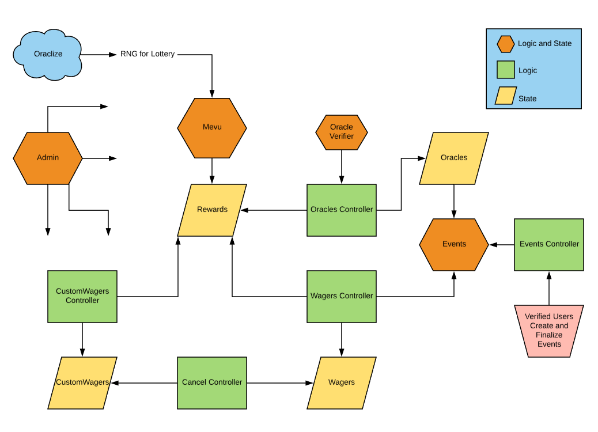

# meVu

A network of smart-contracts to facilitate a system of peer-to-peer betting called [Mevu][mevu].

This code is still in active development and is not yet intended for a main net release.


## Contracts

Please see the [contracts/](contracts) directory.


## Develop

* Contracts are written in [Solidity][solidity] and tested using [Truffle][truffle] and [ganache-cli][ganache-cli] and
the [Oraclize][oraclize] [ethereum-bridge][ethereum-bridge].


### Dependencies

https://github.com/OpenZeppelin/zeppelin-solidity

https://github.com/oraclize/ethereum-api

If testing :

https://github.com/trufflesuite/ganache-cli

https://github.com/oraclize/ethereum-bridge


### Test

```bash
truffle test
```


## Code



### Admin Functions


**setCallbackGasLimit**
```cs
function setCallbackGasLimit (uint newLimit) external onlyAuth
```
Sets the gas limit for the callbcak transaction initiated by the oraclizeAPI.


**setCallbackInterval**
```cs
function setCallbackInterval(uint newInterval) external onlyAuth
```
Sets the interval (seconds) between the callback loops which update events.


**setMinOracleStake**
```cs
function setMinOracleStake (uint newMin) external onlyAuth
```
Sets the minimum stake required for a user to oraclize an event.


**setMinOracleNum**
```cs
function setMinOracleNum (bytes32 eventId, uint min) external onlyAuth
```
Sets the minimum number of Oracles required to satisfactorily determine the winner of a particular event.


**setMinWagerAmount**
```cs
function setMinWagerAmount(uint256 minWager) external onlyAuth
```
Sets the minimum amount of ETH a player is allowed to make a bet with.


**setMaxOracleInterval**
```cs
function setMaxOracleInterval (uint max) external onlyAuth
```
Set the maximum amount of time (seconds) allowable between 
oraclizations for a user to be eligible to win the monthly lottery.


**setOracleRepPenalty**
```cs
function setOracleRepPenalty (int penalty) external onlyAuth
```
Set the reputation penalty incurred by an Oracle who has voted against consensus.


**setOracleRepReward**
```cs
function setOracleRepReward (int reward) external onlyAuth
```
Set the reputation reward awarded to an Oracle who has voted with consensus.


**setPlayerAgreeRepReward**
```cs
function setPlayerAgreeRepReward (int reward) external onlyAuth
```
Set the reputation reward awarded to a player who has successfully settled their bet without requiring Oracles.


**setPlayerDisagreeRepPenalty**
```cs
function setPlayerDisagreeRepPenalty (int penalty) external onlyAuth
```
Set the reputation penalty incurred by a player who disputed an event outcome and was found to be aganist Oracle consensus.


**getCallbackGasLimit**
```cs
function getCallbackGasLimit() external view returns (uint)
```
Returns the gas limit for oraclize callbacks.


**getCallbackInterval**
```cs
function getCallbackInterval() external view returns (uint)
```
Returns the interval (seconds) between oraclize callback loops.


**getMaxOracleInterval**
```cs
function getMaxOracleInterval() external view returns (uint)
```
Returns the max alllowable interval (seconds) between oraclizations for an oracle to be eligible to win the monthly lottery.


**getMinOracleNum**
```cs
function getMinOracleNum (bytes32 eventId) external view returns (uint)
```
Returns minimum number of Oracles required to settle a specific event.


**getMinOracleStake**
```cs
function getMinOracleStake () external view returns (uint)
```
Returns minimum stake required to register as an oracle for an event.


**getMinWagerAmount**
```cs
function getMinWagerAmount() external view returns (uint)
```
Returns minimum amount of ETH required to bet with.


**getOracleRepPenalty**
```cs
function getOracleRepPenalty () external view returns (int)
```
Returns rep penalty incurred by Oracle for reporting against consensus.


**getOracleRepReward**
```cs
function getOracleRepReward () external view returns (int)
```
Returns rep reward awarded to an Oracle for reporting with consensus.


**getPlayerAgreeRepReward**
```cs
function getPlayerAgreeRepReward () external view returns (int)
```
Returns rep reward awarded to a player for settling a bet without requiring Oracles.


**getPlayerDisagreeRepPenalty**
```cs
function getPlayerDisagreeRepPenalty () external view returns (int)
```
Returns rep penalty incurred by a player who diputed an outcome and was found to be against Oracle consensus.


### AuthorityGranter Functions


**grantAuthority**
```cs
function grantAuthority (address nowAuthorized) external onlyOwner
```
Grants an address authority by adding it to the isAuthorized mapping.


**removeAuthority**
```cs
function removeAuthority (address unauthorized) external onlyOwner
```
Takes an address' authority by removing it from the isAuthorized mapping.


### CancelController Functions


**setMevuContract**
```cs
function setMevuContract (address thisAddr) external onlyOwner
```
Sets the address which the latest Mevu contract is deployed to.


**setCustomWagersContract**
```cs
function setCustomWagersContract (address thisAddr) external onlyOwner
```
Sets the address which the latest CustomWagers contract is deployed to.


**setWagersContract**
```cs
function setWagersContract (address thisAddr) external onlyOwner
```
Sets the address which the latest Wagers contract is deployed to.


**setRewardsContract**
```cs
function setRewardsContract (address thisAddr) external onlyOwner
```
Sets the address which the latest Rewards contract is deployed to.


**abortWagerCustom**
```cs
function abortWagerCustom(bytes32 wagerId) internal
```
Settles a custom wager and refunds the players.


**abortWagerStandard**
```cs
function abortWagerStandard(bytes32 wagerId) internal
```
Settles a standard wager and refunds the players.


**cancelWagerStandard**
```cs
function cancelWagerStandard (bytes32 wagerId, bool withdraw) 
    onlyBettorStandard(wagerId)
    notPaused
    notTakenStandard(wagerId)           
    external
```
Cancels a standard wager before a player has taken it.


**cancelWagerCustom**
```cs
function cancelWagerCustom (bytes32 wagerId, bool withdraw) 
    onlyBettorCustom(wagerId)
    notPaused      
    notTakenCustom(wagerId)          
    external
```
Cancels a custom wager before a player has taken it.


**requestCancelCustom**
```cs
function requestCancelCustom (bytes32 wagerId)
    onlyBettorCustom(wagerId)        
    mustBeTakenCustom(wagerId)
    notSettledCustom(wagerId)
    external
```
Requests the cancellation of a matched custom wager.


**requestCancelStandard**
```cs
function requestCancelStandard (bytes32 wagerId)
    onlyBettorStandard(wagerId)
    mustBeTakenStandard(wagerId)       
    notSettledStandard(wagerId)
    external
```
Requests the cancellation of a matched standard wager.


**confirmCancelStandard**
```cs
function confirmCancelStandard (bytes32 wagerId)
    notSettledStandard(wagerId)
    external
```
Confirms the cancellation of a matched standard wager where both players have requested cacellation.


**confirmCancelCustom**
```cs
function confirmCancelCustom (bytes32 wagerId)
    notSettledCustom(wagerId)
    external
```
Confirms the cancellation of a matched custom wager where both players have requested cancellation.


### CustomWagers Functions


**makeWager**
```cs
function makeWager (
        bytes32 wagerId,
        uint endTime,
        uint reportinEndTime,          
        uint origValue,
        uint winningValue,        
        uint makerChoice,
        uint takerChoice,
        uint odds,
        uint makerWinnerVote,
        uint takerWinnerVote,
        address maker,
        address judge
        )
            external
            onlyAuth
```
Creates a wager in the wagers mapping.


**setCancelled**
```cs
function setCancelled (bytes32 wagerId) external onlyAuth
```
Sets a wager as cancelled.


**setSettled**
```cs
function setSettled (bytes32 wagerId) external onlyAuth
```
Sets a wager as settled.


**setMakerWinVote**
```cs
function setMakerWinVote (bytes32 id, uint winnerVote) external onlyAuth
```
After an event is over set the bet maker's vote for the event winner.


**setTakerWinVote**
```cs
function setTakerWinVote (bytes32 id, uint winnerVote) external onlyAuth
```
After an event is over set the bet taker's vote for the event winner.


**setRefund**
```cs
function setRefund (address bettor, bytes32 wagerId) external onlyAuth
```
Sets the boolean indicating that a player has recieved a refund for a particular bet to true.


**setMakerCancelRequest**
```cs
function setMakerCancelRequest (bytes32 id) external onlyAuth
```
Sets the boolean indicating that a bet maker has requested a cancellation for a particular bet to true.


**setTakerCancelRequest**
```cs
function setTakerCancelRequest (bytes32 id) external onlyAuth
```
Sets the boolean indicating that a bet taker has requested a cancellation for a particular bet to true.


**setTaker**
```cs
function setTaker (bytes32 wagerId, address taker) external onlyAuth
```
Sets the taker for a bet.


**setWinner**
```cs
function setWinner (bytes32 id, address winner) external onlyAuth
```
Sets the winner for a bet.


**setJudgesVote**
```cs
function setJudgesVote (bytes32 id, uint vote) external onlyAuth
```
Sets the judges vote for a bet.


**setLoser**
```cs
function setLoser (bytes32 id, address loser) external onlyAuth
```
Sets the loser for a bet.


**setWinningValue**
```cs
function setWinningValue (bytes32 wagerId, uint value) external onlyAuth
```
Sets the amount that the bet winner will recieve before fees.


**getCancelled**
```cs
function getCancelled (bytes32 wagerId) external view returns (bool)
```
Returns the bool indicating if the given bet has been cancelled.


**getEndTime**
```cs
function getEndTime (bytes32 wagerId) external view returns (uint)
```
Returns the end timestamp of the given bet.


**getReportingEndTime**
```cs
function getReportingEndTime (bytes32 wagerId) external view returns (uint)
```
Returns the end timestamp of the reporting period for a given bet.


**getLocked**
```cs
function getLocked (bytes32 id) external view returns (bool)
```
Returns true if the given bet has been taken.


**getSettled**
```cs
function getSettled (bytes32 id) external view returns (bool)
```
Returns true if the given bet has been settled (paid out or cancelled).


**getMaker**
```cs
function getMaker(bytes32 wagerId) external view returns (address)
```
Returns the bets maker.


**getTaker**
```cs
function getTaker(bytes32 wagerId) external view returns (address)
```
Returns the bets taker.


**getMakerChoice**
```cs
function getMakerChoice (bytes32 wagerId) external view returns (uint)
```
Returns the team number the maker bet on.


**getTakerChoice**
```cs
function getTakerChoice (bytes32 wagerId) external view returns (uint)
```
Returns the team number the taker bet on.


**getMakerCancelRequest**
```cs
function getMakerCancelRequest (bytes32 wagerId) external view returns (bool)
```
Returns true if the maker has requested a bet cancellation.


**getTakerCancelRequest**
```cs
function getTakerCancelRequest (bytes32 wagerId) external view returns (bool)
```
Returns true if the taker has requested a bet cancellation.


**getMakerWinVote**
```cs
function getMakerWinVote (bytes32 wagerId) external view returns (uint)
```
Returns the maker's vote for the event winner regarding a given bet.


**getTakerWinVote**
```cs
function getTakerWinVote (bytes32 wagerId) external view returns (uint)
```
Returns the taker's vote for the event winner regarding a given bet.


**getRefund**
```cs
function getRefund (address bettor, bytes32 wagerId) external view returns (bool)
```
Returns true if the given bettor has already recieved a refund for the given bet.


**getOdds**
```cs
function getOdds (bytes32 wagerId) external view returns (uint)
```
Returns the odds for a given bet.


**getOrigValue**
```cs
function getOrigValue (bytes32 wagerId) external view returns (uint)
```
Returns the amount sent by the maker for a given bet.


**getWinningValue**
```cs
function getWinningValue (bytes32 wagerId) external view returns (uint)
```
Returns the amount sent by the maker and taker for a given bet.


**getWinner**
```cs
function getWinner (bytes32 wagerId) external view returns (address)
```
Returns the winner of a given bet.


**getLoser**
```cs
function getLoser (bytes32 wagerId) external view returns (address)
```
Returns the loser of a given bet.  


**getJudge**
```cs
function getJudge (bytes32 wagerId) external view returns (address)
```
Returns the judge of a given bet.


**getJudgesVote**
```cs
function getJudgesVote (bytes32 wagerId) external view returns (uint)
```
Returns the vote cast by a judge of a given bet.


### CustomWagersController Functions


**setAdminContract**
```cs
function setAdminContract (address thisAddr) external onlyOwner
```
Sets the address which the latest Admin contract is deployed to.


**setMevuContract**
```cs
function setMevuContract (address thisAddr) external onlyOwner
```
Sets the address which the latest Mevu contract is deployed to.


**setCustomWagersContract**
```cs
function setCustomWagersContract (address thisAddr) external onlyOwner
```
Sets the address which the latest CustomWagers contract is deployed to.


**setRewardsContract**
```cs
function setRewardsContract (address thisAddr) external onlyOwner
```
Sets the address which the latest Rewards contract is deployed to.


**makeWager**
```cs
function makeWager (
        bytes32 id,
        uint endTime,
        uint reportingEndTime,
        uint makerChoice,
        uint value,
        uint odds,
        address judge
        )
        notMade(id)    
        checkBalance(value)
        notPaused
        external
        payable
```
Used by a player to make a new bet.


**takeWager**
```cs
function takeWager (
        bytes32 id,
        address judge      
    )
        notTaken(id)
        notOver(id)
        external
        payable
```
Used by a player to take a bet.


**submitVote**
```cs
function submitVote (      
        bytes32 wagerId,
        uint winnerVote
    ) 
        onlyBettor(wagerId) 
        mustBeEnded(wagerId)
        notSettled(wagerId)
        notPaused
        external
```
Used by a player to submit vote for winner after event has ended.


**submitJudgeVote**
```cs
function submitJudgeVote (bytes32 wagerId, uint vote)
        mustBeEnded(wagerId)
        notSettled(wagerId)
        validVote(vote)
        external 
```
Used by a player assigned as a judge for a custom wager to submit vote for winner after event has ended.


**settle**
```cs
function settle(bytes32 wagerId) internal
```
Settles bet after both bettors have voted.


**judgeSettle**
```cs
function judgeSettle (
        bytes32 wagerId,
        address judge,
        uint judgesVote,
        address maker,
        address taker,
        uint makerWinVote,
        uint origValue,
        uint payoutValue
        )
        internal 
```
Settles bet after the judge has voted.


**tieJudged**
```cs
function tieJudged(address judge, address maker, address taker, uint origValue, uint payoutValue ) internal
```
Facilitates payout if the judge had to rule a tie.


**checkJudge**
```cs
function checkJudge (bytes32 wagerId, address maker, address taker, uint makerWinVote, uint takerWinVote, uint origValue, uint payoutValue) internal
```
Checks to see if there has been a judge appointed, if so, checks to see if they've voted yet. If there is no judge the wager is aborted.


**finalizeAbandonedBet**
```cs
function finalizeAbandonedBet (bytes32 wagerId) 
    onlyBettor(wagerId)
    reportingOver(wagerId)
    external
```
Allows a bettor to reclaim their eth if the person they are betting with never reports.


**payout**
```cs
function payout(bytes32 wagerId, address maker, address taker, uint payoutValue, bool agreed) internal
```
Pays out a settled wager.


**withdraw**
```cs
function withdraw(
        uint eth    
    )
        notPaused   
        external
```
Allows a user to withdraw eth that may still be in the mevu contract due to an aborted wager.


**abortWager**
```cs
function abortWager(bytes32 wagerId) internal
```
Sets a wager as settled and unlocks the eth so users can withdraw.


### CustomWagersController Events

**JudgeNeeded**
```cs
event JudgeNeeded (address judge, bytes32 wagerId)
```


**WagerMade**
```cs
event WagerMade(bytes32 id)
```


**WagerTaken**
```cs
event WagerTaken(bytes32 id)
```


**WagerSettled**
```cs
event WagerSettled(bytes32 wagerId)
```


### Events Functions


**setAdminContract**
```cs
function setAdminContract (address thisAddr) external onlyOwner
```
Sets the address which the latest Admin contract is deployed to.


**setMevuContract**
```cs
function setMevuContract (address thisAddr) external onlyOwner
```
Sets the address which the latest Mevu contract is deployed to.


**setOraclesContract**
```cs
function setOraclesContract (address thisAddr) external onlyOwner
```
Sets the address which the latest Oracles contract is deployed to.


**makeStandardEvent**
```cs
function makeStandardEvent(
        bytes32 id,
        bytes32 name,
        uint startTime,
        uint duration,
        bytes32 teamOne,
        bytes32 teamTwo
    )
        external
        onlyOwner
```
Creates a supported event for users to bet on and oraclize.


**addResolvedWager**
```cs
function addResolvedWager (bytes32 eventId, uint value) external onlyAuth
```
Adds the value of a resolved wagger to the running total value of resolved wagers based on a specific event.


**determineEventStage**
```cs
function determineEventStage (bytes32 thisEventId, uint lastIndex) external onlyAuth
```
If an event is recently completed, it is designated as voteReady, if it was already voteReady then it is now locked.


**decideWinner**
```cs
function decideWinner (bytes32 eventId) internal
```
Determines the winner of a completed event based on oracle votes.


**removeEventFromActive**
```cs
function removeEventFromActive (bytes32 eventId) internal
```
Removes an event which is over and settled from the active events array.


**removeWager**
```cs
function removeWager (bytes32 eventId, uint value) external onlyAuth
```
Removes wager data from the event struct.


**addWager**
```cs
function addWager(bytes32 eventId, uint value) external onlyAuth
```
Adds wager data to the event struct.


**setWinner**
```cs
function setWinner (bytes32 eventId, uint winner) public onlyAuth
```
Sets event winner.


**setLocked**
```cs
function setLocked (bytes32 eventId) public onlyAuth
```
Sets event as locked.


**getFinished**
```cs
function getFinished (bytes32 eventId) external view returns (bool)
```
Returns true if the current block time is later than the event end time.


**getActiveEventId**
```cs
function getActiveEventId (uint i) external view returns (bytes32)
```
Returns the bytes32 id of the wager in the active events array at the given index.


**getActiveEventsLength**
```cs
function getActiveEventsLength () external view returns (uint)
```
Returns the length of the active events array.


**getStandardEventCount**
```cs
function getStandardEventCount () external view returns (uint)
```
Returns the total number of events ever.


**getTotalAmountBet**
```cs
function getTotalAmountBet (bytes32 eventId) external view returns (uint)
```
Returns the total number of events ever.


**getTotalAmountResolvedWithoutOracles**
```cs
function getTotalAmountResolvedWithoutOracles (bytes32 eventId) external view returns (uint)
```
Returns the amount of wei that bettors on this event who have resolved without oracles have bet.


**getCancelled**
```cs
function getCancelled(bytes32 id) external view returns (bool)
```
Returns true if the given event has been cancelled.


**getStart**
```cs
function getStart (bytes32 id) public view returns (uint)
```
Returns the start time (timestamp in seconds) of given event.


**getDuration**
```cs
function getDuration (bytes32 id) public view returns (uint)
```
Returns the duration (seconds) of given event.


**getEndTime**
```cs
function getEndTime (bytes32 id) public view returns (uint)
```
Returns the end time (timestamp in seconds) of given event.


**getLocked**
```cs
function getLocked(bytes32 id) public view returns (bool)
```
Returns true if event is over and settled or cancelled.


**getWinner**
```cs
function getWinner (bytes32 id) external view returns (uint)
```
Returns the winner of the event.  1 = team one,  2 = team two,  3 = tie,  4 = no clear winnner


**getVoteReady**
```cs
function getVoteReady (bytes32 id) public view returns (bool)
```
Returns true if the event is currently in the voting/reporting period (i.e. finished but not locked).


**makeVoteReady**
```cs
function makeVoteReady (bytes32 id) internal
```
Sets an event as vote ready to initiate the voting period.


### Events Events


**EventVoteReady**
```cs
event EventVoteReady(bytes32 eventId)
```


### Mevu Functions


**setAdminContract**
```cs
function setAdminContract (address thisAddr) external onlyOwner
```
Sets the address which the latest Admin contract is deployed to.


**setEventsContract**
```cs
function setEventsContract (address thisAddr) external onlyOwner
```
Sets the address which the latest Events contract is deployed to.


**setMvuTokenContract**
```cs
function setEventsContract (address thisAddr) external onlyOwner
```
Sets the address which the latest Events contract is deployed to.


**setOraclesContract**
```cs
function setOraclesContract (address thisAddr) external onlyOwner
```
Sets the address which the MvuToken contract is deployed to.


**setRewardsContract**
```cs
function setRewardsContract (address thisAddr) external onlyOwner
```
Sets the address which the latest Rewards contract is deployed to.


**setWagersContract**
```cs
function setWagersContract (address thisAddr) external onlyOwner
```
Sets the address which the latest Wagers contract is deployed to.


**setMevuWallet**
```cs
function setMevuWallet (address newAddress) external onlyOwner
```
Sets the address which the mevu multi-sig wallet is deployed to.


**abandonContract**
```cs
function abandonContract() external onlyPaused
```
Allows user to abandon contract and withdraw funds if platform has been compromised and admin has paused it.


**__callback**
```cs
function __callback (bytes32 myid, string result)  notPaused
```
Is called by Oraclize API.


**randomNum**
```cs
function randomNum(uint max) private
```
Calls the oraclize contract for a random number generated through the Wolfram Alpha engine.


**checkLottery**
```cs
function checkLottery() internal
```
Checks to see if a month (in seconds) has passed since the last lottery paid out, pays out if so.


**payoutLottery**
```cs
function payoutLottery(address potentialWinner) internal
```
Pays out the monthly lottery balance to a random oracle.


**playerRefund**
```cs
function playerRefund (bytes32 wagerId) external  onlyBettor(wagerId)
```
Players should call this when an event has been cancelled after thay have made a wager to recieve a refund.


**allowedToWin**
```cs
function allowedToWin (address potentialWinner) internal view returns (bool)
```
Checks if a potential lottery winner has oraclized an event recently enough to be eligible to win.


**pauseContract**
```cs
function pauseContract () external onlyOwner
```
Pauses the contract, preventing betting and only allowing emergency withdrawals.


**restartContract**
```cs
function restartContract(uint secondsFromNow) external onlyOwner payable
```
Restarts a paused contract by reinitiating the oraclize recursion.


**mevuWithdraw**
```cs
function mevuWithdraw (uint amount) external onlyOwner
```
Allows mevu team to withdraw earnings to multi-sig wallet.


**addMevuBalance**
```cs
function addMevuBalance (uint amount) external onlyAuth
```
Adds to the mevu balance.


**addEventToIterator**
```cs
function addEventToIterator () external onlyAuth
```
Adds one to the iterator index.


**addLotteryBalance**
```cs
function addLotteryBalance (uint amount) external onlyAuth
```
Adds to the lottery balance.


**addToPlayerFunds**
```cs
function addToPlayerFunds (uint amount) external onlyAuth
```
Adds to the player funds balance.


**subFromPlayerFunds**
```cs
function subFromPlayerFunds (uint amount) external onlyAuth
```
Subs from the player funds balance.


**transferEth**
```cs
function transferEth (address recipient, uint amount) external onlyAuth
```
Transfers eth from the mevu contract.


**getContractPaused**
```cs
function getContractPaused() external view returns (bool)
```
Returns true if contract is paused.


**getOracleFee**
```cs
function getOracleFee () external view returns (uint256)
```
Returns the oracle service fee.


**transferTokensToMevu**
```cs
function transferTokensToMevu (address oracle, uint mvuStake) internal
```
Transfers MVU tokens to the mevu contract.


**transferTokensFromMevu**
```cs
function transferTokensFromMevu (address oracle, uint mvuStake) external onlyAuth
```
Transfers MVU tokens from the mevu contract.


**addMonth**
```cs
function addMonth () internal
```
Resets the newMonth variable to a month in the future.


**getNewMonth**
```cs
function getNewMonth () internal view returns (uint256)
```
Resets the newMonth variable, this is when the lottery will payout.


**uintToBytes**
```cs
function uintToBytes(uint v) internal view returns (bytes32 ret)
```
Returns the bytes32 of a given uint.


**bytes32ToString**
```cs
function bytes32ToString (bytes32 data) internal view returns (string)
```
Returns the string of a given bytes32.


### Mevu Events


**NewOraclizeQuery**
```cs
event NewOraclizeQuery (string description)
```


### Oracles Functions


**addOracle**
```cs
function addOracle (address oracle, bytes32 eventId, uint mvuStake, uint winnerVote) external onlyAuth
```


**removeOracle**
```cs
function removeOracle (address oracle, bytes32 eventId) external onlyAuth
```
Adds an oracle and their vote info to the oracleStructs and eventStructs mappings.


 


## License

MIT License

[mevu]: https://mevu.bet
[solidity]: https://solidity.readthedocs.io/en/develop/
[truffle]: http://truffleframework.com/
[ganache-cli]: https://github.com/trufflesuite/ganache-cli
[openzeppelin]: https://openzeppelin.org
[oraclize]: http://www.oraclize.it/
[ethereum-bridge]: https://github.com/oraclize/ethereum-bridge